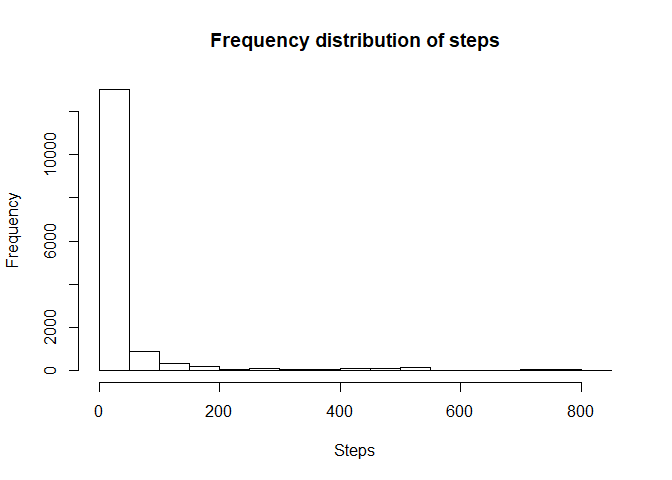

# Reproducible Research: Peer Assessment 1
Amy Burnett Cross  


## Loading and preprocessing the data

Load the data (previously saved in the working directory).

```r
unzip("activity.zip")
activity <- read.csv("activity.csv")
## Process/transform the data (if necessary) into a format suitable for your analysis
```

Filter all na values.

```r
activity <- activity[!is.na(activity$steps),]
```


## What is mean total number of steps taken per day?
Calculate the total number of steps taken per day

```r
library(dplyr)
```

```
## Warning: package 'dplyr' was built under R version 3.4.3
```

```
## 
## Attaching package: 'dplyr'
```

```
## The following objects are masked from 'package:stats':
## 
##     filter, lag
```

```
## The following objects are masked from 'package:base':
## 
##     intersect, setdiff, setequal, union
```

```r
daily_activity <- activity %>% group_by(date) %>%
    summarise(total_steps = sum(steps))
```

Print a histogram of the number of steps per five minute period.

```r
hist(activity$steps,
     main = "Frequency distribution of steps",
     xlab = "Steps")
```

<!-- -->

Calculate the mean number of steps per five minute period.

```r
mean(activity$steps)
```

```
## [1] 37.3826
```

Calculate the median number of steps per five minute period.

```r
median(activity$steps)
```

```
## [1] 0
```


## What is the average daily activity pattern?
____________________________
library("ggplot2")

f = c(1, 2, NA)
s = c(3, 4, NA)
df = data.frame(f, s)
df_cc <- df[complete.cases(df),]

j <- ggplot(df_cc, aes(f, s))
j + geom_line()

# x, y, alpha, color, linetype, size
_____________________________


real_activity <- activity[complete.cases(activity),]
j <- ggplot(real_activity, aes(date, steps))
j + geom_line()
____________________________
daily_avg_steps <- tapply(real_activity$steps, real_activity$date, mean)
real_das <- daily_avg_steps[complete.cases(daily_avg_steps)]
j <- ggplot(real_das, aes())
j + geom_line(date, steps)


## Imputing missing values
library(ggplot2)


## Are there differences in activity patterns between weekdays and weekends?
